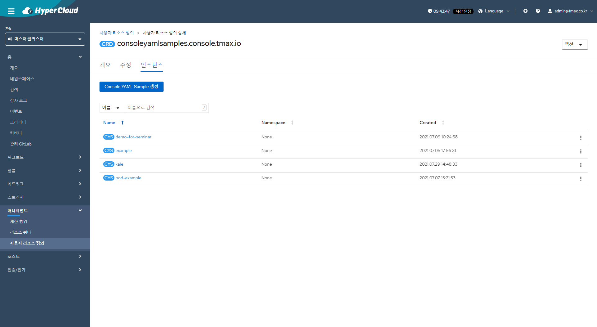

[< Home](/console/)

# Console YAML Samples 사용 가이드

## Console YAML Sample 설명

- Yaml Editor 에서 제공되는 Sidebar(스키마 및 샘플 기능 제공) 에서 샘플 YAML 을 Editor 로 보내 주거나(Try it) 다운로드(Download YAML) 하게 해줌
- Sidebar 에서는 consoleYAMLsamples CRD의 CR을 조회하여 Sample Yaml 을 제공함
  - 등록된 consoleYAMLsamples CR 의 spec.targetResource.kind 기준으로 조회하여 해당 리소스의 여려개의 샘플들을 제공
    [](figure/1.Sidebar_Schema.png)
    [](figure/2.Sidebar_Sample.png)

## 사용 전 확인 사항

- consoleYAMLsamples CRD 확인
  - (마스터 클러스터) - 매니지먼트 - 사용자 리소스 정의
    [](figure/3.consoleYAMLsamples_CRD.png)
  - consoleyamlsamples.console.tmax.io CRD 존재 확인
    [](figure/4.consoleYAMLsamples_CRD_Detail.png)

## consoleYAMLsamples CRD spec 설명

- title - sidebar 에서 보여줄 sample 의 이름
- description - sidebar 에서 보여줄 sample 의 설명
- targetResource - 어떤 리소스 sample 인지 명시
  - apiVersion
  - kind
- yaml - YAML Editor 로 보내줄 YAML 내용

```yaml
apiVersion: console.tmax.io/v1
kind: ConsoleYAMLSample
metadata:
  name: example-for-sample
spec:
  description: An example Job for sample add
  targetResource:
    apiVersion: batch/v1
    kind: Job
  title: Example Sample
  yaml: |
    Sample YAML
```

## Sample 등록

1. CR 생성

    - 1.1 Import YAML
      - CLI 로 [Jab_Sample.yaml](yaml/Jab_Sample.yaml) 실행하거나 `ex) kubectl apply -f Jab_Sample.yaml`
      - Hypercloud 에서 YAML 을 Import

    `/k8s/all-namespaces/import`
    `/k8s/cluster/customresourcedefinitions/console.tmax.io~v1~ConsoleYAMLSample/~new`

    [](figure/5.import_YAML.png)
    [](figure/6.import_YAML_example.png)

    - 1.2
      - Hypercloud 에서 Form View 에서 작성

    `/k8s/cluster/customresourcedefinitions/console.tmax.io~v1~ConsoleYAMLSample/~new`

    [](figure/7.consoleYAMLsamples_CRD_List.png)
    [](figure/8.consoleYAMLsamples_CRD_Create.png)  
2. sidebar 에서 확인
  [](figure/9.consoleYAMLsamples_Check.png)

[< Home](/console/)
