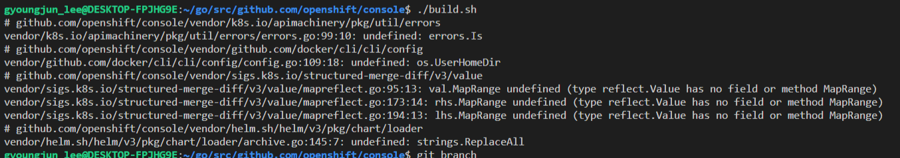
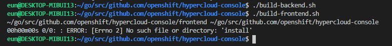
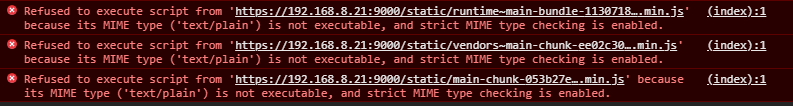
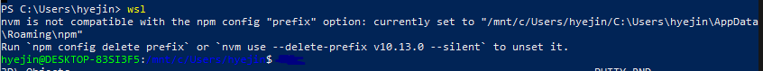
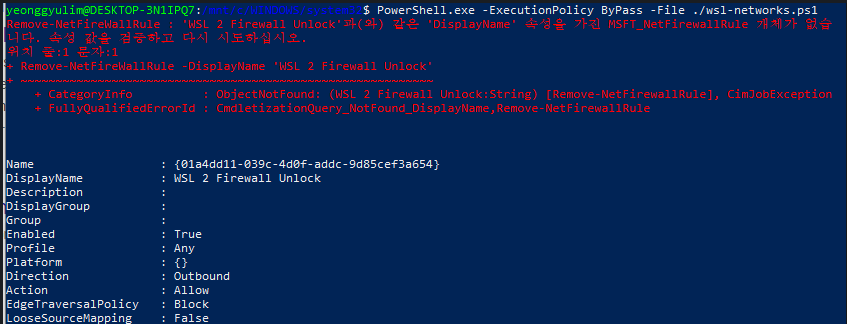
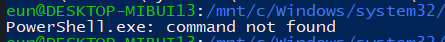
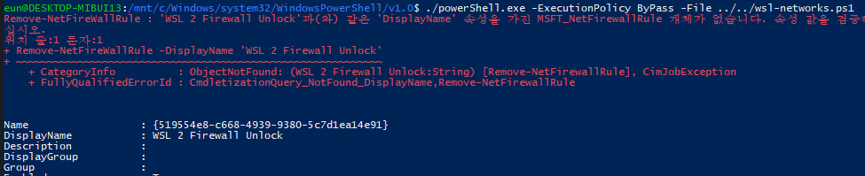
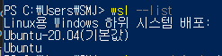

[< Home](/console/)

# 📕 Linux 개발 환경 구축 (WSL2)


## WSL2 환경 구축

- 기본 Flow 참고: [윈도우10 리액트 개발환경 구축 참고 링크](https://makebabysmile.com/2020/04/06/%EC%9C%88%EB%8F%84%EC%9A%B010-%EB%A6%AC%EC%95%A1%ED%8A%B8-%EA%B0%9C%EB%B0%9C%ED%99%98%EA%B2%BD-%EA%B5%AC%EC%B6%95-wsl-2/)

1. Window 버전 Update

   [](images/wsl_image_1.png)

2. Ubuntu 설치(Microsoft Store: 최신 LTS - 20.04 사용을 권장함)
3. WSL2 설치 및 버전 변환: [https://www.lesstif.com/software-architect/wsl-2-windows-subsystem-for-linux-2-89555812.html](https://www.lesstif.com/software-architect/wsl-2-windows-subsystem-for-linux-2-89555812.html)

<br/>

---

## VSCode 개발 환경 세팅

1. ‘Remote – WSL’ 확장 프로그램을 설치
2. WSL: Ubuntu에 연결(Status bar 좌측 초록색 버튼)
3. WSL: Ubuntu에 “Node Extension Pack” 확장 프로그램을 설치

- HyperCloud 개발 환경 구축 ([hypercloud console GitHub](https://github.com/tmax-cloud/console))

  1. git clone

     ```shell
     git clone https://github.com/tmax-cloud/console console
     ```

     (폴더 위치: /home/${user}/)

  2. install curl

     ```shell
     sudo apt-get install curl
     ```

  3. install nvm

     ```shell
     curl -o- https://raw.githubusercontent.com/nvm-sh/nvm/v0.35.3/install.sh | bash
     ```

     (Latest Version: [https://github.com/nvm-sh/nvm](https://github.com/nvm-sh/nvm))

  4. install node (12 +)

     ```shell
     nvm install 12.13.0
     ```

  5. install yarn (1.3.2 +)

     ```shell
     npm install -g yarn
     ```

  6. install go (1.15 +)

     (Latest Version) `sudo apt-get install golang-go ` 
     <br/>
     go버전 1.15.5 아래 링크 가이드를 통해 설치 (root에 설치 권장)
     👉 [https://www.tecmint.com/install-go-in-ubuntu/](https://www.tecmint.com/install-go-in-ubuntu/)
     <br/>

  7. install jq

     ```shell
     sudo apt-get install jq
     ```
       **✅ 7번 까지 설치하면 프로젝트 실행 가능 kubectl 설치는 필수 아님**
   <br/>

  8. install kubectl ([https://kubernetes.io/ko/docs/tasks/tools/install-kubectl/#리눅스에-kubectl-설치](https://kubernetes.io/ko/docs/tasks/tools/install-kubectl/#%EB%A6%AC%EB%88%85%EC%8A%A4%EC%97%90-kubectl-%EC%84%A4%EC%B9%98))

     ```shell
     curl -LO https://storage.googleapis.com/kubernetes-release/release/v1.19.0/bin/linux/amd64/kubectl // 최신 release download
     sudo chmod +x ./kubectl // 실행 권한 부여
     sudo mv ./kubectl /usr/local/bin/kubectl // 실행 PATH 설정된 directory로 이동
     kubectl version --client // 버전 확인
     ```
<br/>

---    

## 실행

1. 빌드 스크립트 실행

   ```shell
   make build-dev
   ```

2. 새 터미널 열고 run-console 스크립트 실행

   ```shell
   make run-console
   ```

3. HyperCloud 페이지 `https://{이름}.tmaxcloud.org/` 접속 (호스트명은 서버 담당자에게 문의)

## 발생할 수 있는 에러 유형 및 해결법

- undefined: [errors.Is](http://errors.Is) (./build-backend.sh)

  [](images/wsl_image_3.png)

  ⇒ go version 1.15.\*로 version upgrade 후, 해결

- No such file or directory: 'install' (./build-frontend.sh)

  [](images/wsl_image_4.png)

  ⇒ [https://stackoverflow.com/questions/46013544/yarn-install-command-error-no-such-file-or-directory-install](https://stackoverflow.com/questions/46013544/yarn-install-command-error-no-such-file-or-directory-install)

- RPC 서버를 사용할 수 없습니다.

  [](images/wsl_image_5.png)

  ⇒ RPC 서버 재시작 / 윈도우 포맷

- HC 4.1 정상 빌드 후 실행 시 하얀 화면만 나오고 개발자 도구에 에러 발생

  [](images/wsl_image_6.png)

  ⇒

  1. 레지스트리 편집기 열기 `Win + R > regedit`
  2. `HKEY_CLASSES_ROOT\.js` 경로로 들어가기
     - Content Type 이 `text/javascript` 인지 확인 후 변경 & 재부팅  
<br/>

---


## WSL2 외부 네트워크로 연결  

1. PowerShell 관리자 모드로 열기
2. wsl 접속

   [](images/wsl_image_7.png)

3. 접속한 wsl의 아무 위치나 상관 없이 wsl-networks.ps1 파일 생성 (찾기 쉬운 위치로 지정하는 것 추천)

   포트 변경시 `$ports=@(80,443,9000, 9001);` 이 줄에 추가

   ```shell
   $remoteport = bash.exe -c "ifconfig eth0 | grep 'inet '"
   $found = $remoteport -match '\d{1,3}\.\d{1,3}\.\d{1,3}\.\d{1,3}';

   if( $found ){
     $remoteport = $matches[0];
   } else{
     echo "The Script Exited, the ip address of WSL 2 cannot be found";
     exit;
   }

   #[Ports]

   #All the ports you want to forward separated by coma
   $ports=@(80,443,9000, 9001);

   #[Static ip]
   #You can change the addr to your ip config to listen to a specific address
   $addr='0.0.0.0';
   $ports_a = $ports -join ",";

   #Remove Firewall Exception Rules
   iex "Remove-NetFireWallRule -DisplayName 'WSL 2 Firewall Unlock' ";

   #adding Exception Rules for inbound and outbound Rules
   iex "New-NetFireWallRule -DisplayName 'WSL 2 Firewall Unlock' -Direction Outbound -LocalPort $ports_a -Action Allow -Protocol TCP";
   iex "New-NetFireWallRule -DisplayName 'WSL 2 Firewall Unlock' -Direction Inbound -LocalPort $ports_a -Action Allow -Protocol TCP";

   for( $i = 0; $i -lt $ports.length; $i++ ){
     $port = $ports[$i];
     iex "netsh interface portproxy delete v4tov4 listenport=$port listenaddress=$addr";
     iex "netsh interface portproxy add v4tov4 listenport=$port listenaddress=$addr connectport=$port connectaddress=$remoteport";
   }
   ```

4. `PowerShell.exe -ExecutionPolicy ByPass -File ./wsl-networks.ps1` 명령 실행

   [](images/wsl_image_8.png)

   이 에러는 무시해도 괜찮음. 다음 실행부터는 안남...

   - PowerShell.exe가 없다는 에러 발생시

     [](images/wsl_image_9.png)

     powershell.exe가 있는 폴더를 찾아 들어가서 직접 실행해주면 됨 (TODO: alias 설정)

     `/mnt/c/Windows/System32/WindowsPowerShell/v1.0/powershell.exe`

     [](images/wsl_image_10.png)

5. 완료! 외부에서 로컬IP:PORT 로 접근 가능 (ex. https://192.168.8.21:9000)

### ☝ 위와 같이 했는데 외부접속이 안된다면..

- wsl로 접속한 Ubuntu버전 확인하기

  - PowerShell 접속 후 'wsl —list' 커맨드 입력

    [](images/wsl_image_11.png)

  - hypercloud 프로젝트가 있는 Ubuntu버전으로 default 설정돼있는지 확인
  - default가 다른 버전으로 돼있다면 'wsl —setdefault [제품버전명]'(예: 'wsl —setdefault Ubuntu-20.04') 로 default설정 바꾼 뒤 위에 1번부터 다시 진행해보기  

<br/>

---

### etc
- TODO: 작업 스케줄러에 등록해두면 매번 명령을 실행하지 않아도 됨..
- [https://github.com/microsoft/WSL/issues/4150](https://github.com/microsoft/WSL/issues/4150)
